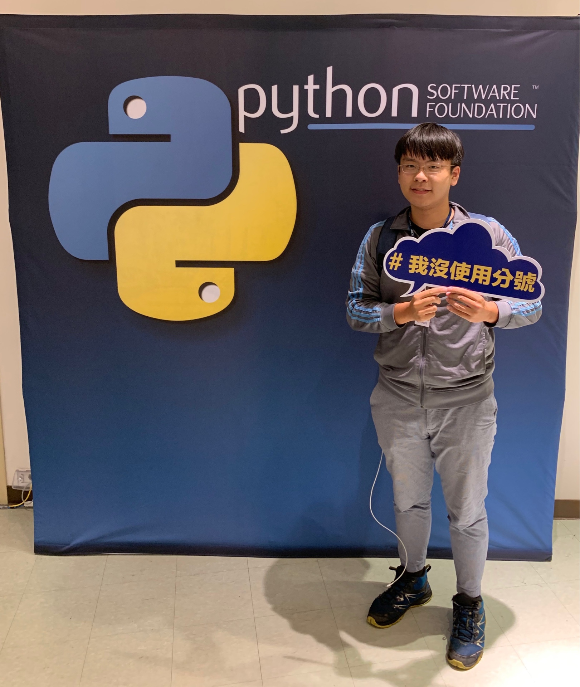

# 2019_PyCon_note

## Me in PyCon 2019

## Overview

This repository is a personal note archive from PyCon 2019. It contains Markdown notes from multiple conference days, covering talks on deep learning, robotics, statistics, sparse modeling, numerical software, probabilistic programming, neural network visualization, cybersecurity, automotive systems, and finance-related Python applications.

## Notes by day

### Day 1 — `pycon_note_day1.md`

Day 1 focuses heavily on machine learning, robotics, APIs, security, and vehicle communication:

- **Understanding Deep Neural Networks** — notes on RNNs, LSTM, GRU, sequence-to-sequence models, encoder/decoder design, evaluation metrics such as perplexity and ROUGE, and research questions around whether seq2seq models understand meaning.
- **Donkey Car self-driving project** — introduction to a Raspberry Pi based autonomous car platform using Python, neural networks, image collection, browser-based control, CNN training in Colab, and vehicle control components such as ESC, I2C, PWM, servo, and motor updates.
- **Transforming research code into ML APIs** — notes on converting research-oriented machine learning code into usable Python APIs, including a reference to Python decorators.
- **Zip bomb / VirusTotal / CVE topic** — notes on zip bombs, mitigation, creating zip bombs with Python `zipfile`, and references to Python bug reports and CVE-2019-9674.
- **Py車達人** — notes on CANBus, two-wire vehicle communication, J1939/J1929-style protocol references, and socketCAN on BeagleBone.

### Day 2 — `pycon_note_day2.md`

Day 2 covers programming languages, statistics, explainable AI, numerical software, probabilistic programming, and visualization:

- **Programming Language Tourism** — reminder to explore other languages beyond Python, with Idris listed as an example.
- **Practicing Statistics in Python** — notes on hypothesis testing, p-values, mean interpretation, statistical test selection, SciPy `ttest_ind`, and visual probability resources.
- **Sparse modeling with `spm-image`** — discussion of sparse modeling, image/time-series analysis, explainable AI, interpretable models, missing data, data augmentation, transfer learning, L0/L1 optimization, and compressed sensing for MRI.
- **Develop Numerical Software** — notes on research code, clear code, niche scientific software, expensive professional tools, and long software lifecycles.
- **Deep Probabilistic Programming with Pyro** — links to Pyro resources, slides, and probabilistic programming tutorials.
- **Lucid neural network visualization** — notes on activation grids, UMAP projections, and TensorFlow Lucid for visualizing neural networks.

### Day 3 — `pycon_note_day3.md`

Day 3 currently contains finance-focused keynote notes and a placeholder for another talk:

- **Artificial Intelligence in Finance** — notes on Dr. Yves J. Hilpisch, The Python Quants, The AI Machine, financial data science, AI, algorithmic trading, computational finance, Python for Finance, derivatives analytics, DX Analytics, and the question of whether markets are predictable.
- **Foreign exchange crawler talk placeholder** — a section title for “你到底匯還是不匯？（當爬蟲遇上外匯...）” by Kilik Kuo is present, but detailed notes have not yet been added.

## Main themes

Across the notes, several themes appear repeatedly:

1. **Python as a bridge between research and production** — talks discuss moving from research code to APIs, building numerical software, and applying Python in finance, statistics, robotics, and AI.
2. **Machine learning interpretability and control** — notes cover neural network behavior, sparse modeling, explainable AI, Lucid visualization, and sequence model control signals.
3. **Hands-on systems and hardware** — Donkey Car, CANBus, Raspberry Pi, BeagleBone, and socketCAN show Python being used outside pure software environments.
4. **Security awareness** — the zip bomb and CVE notes connect Python tooling with vulnerability research and defensive thinking.
5. **Applied data science** — statistics, hypothesis testing, probabilistic programming, compressed sensing, finance, and neural network visualization all show Python's role in practical data analysis.

## Suggested future improvements

- Fix date/title inconsistencies in the note headings, such as Day 3 being labeled as Day 2 in `pycon_note_day3.md`.
- Add missing details for incomplete sections, especially the foreign-exchange crawler talk.
- Normalize speaker names, room labels, and talk titles across all note files.
- Add links to official PyCon pages, slides, or video recordings where available.
- Move each talk into a consistent structure: title, speaker, room, key ideas, resources, and personal takeaway.
